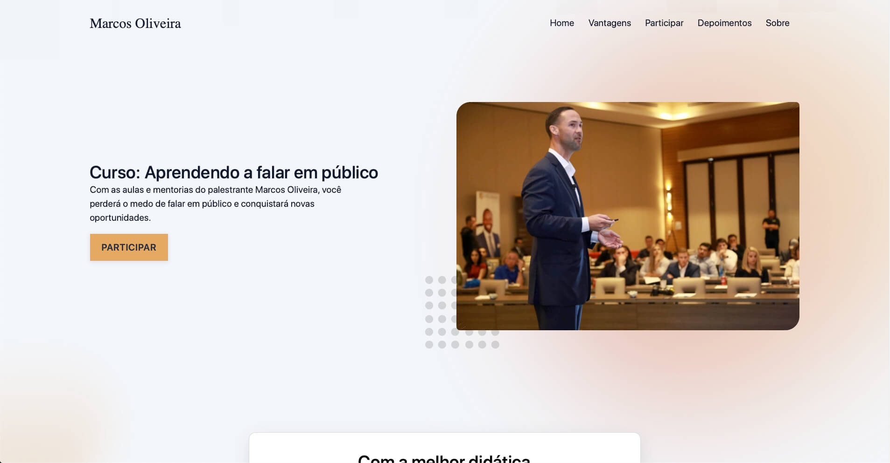

# Marcos Oliveira - Palestrante | Landing Page


📎 &nbsp; **Site:** [palestrante.vercel.app](https://palestrante.vercel.app)



> Uma Landing Page (Página de Conversão, Vendas ou Captura) de um palestrante fictício. Feita com tecnologias modernas, visando melhorar a usabilidade e SEO.

### Ajustes e melhorias

O projeto encontra-se em constante desenvolvimento e as próximas atualizações serão voltadas nas seguintes tarefas:

- [ ] Refatorar código da Navbar

## 📒 &nbsp; Tecnologias Usadas


## 💻 &nbsp; Pré-requisitos

Antes de começar, verifique se você atendeu aos seguintes requisitos:

* Você instalou a versão estável ou a mais recente do `Node.js`

## 🚀 &nbsp; Instalando o projeto

Para clonar o projeto em sua máquina, siga estas etapas:

Windows, Linux e macOS:
```
git clone https://github.com/Nelson-DevStack/palestrante
cd palestrante
yarn
```

## ☕ &nbsp; Executando o projeto

Para executar o projeto no servidor local (localhost:5173), execute o comando:

```
yarn run dev
```

E se desejar export o servidor na sua rede:
```
yarn run dev --host
```


[⬆ Voltar ao topo](#palestrante)<br>